# Ellie Mae Photography
This project is for Code Institute's Portfolio One project. In this project we are covering in what we learned in the HTML and CSS modules.

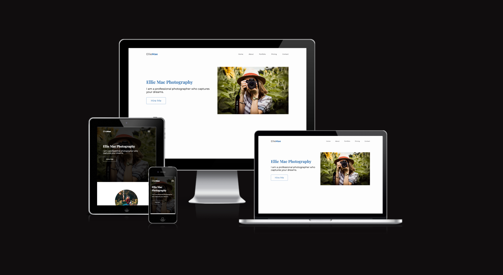

[Live Preview](https://edwardshanahan07.github.io/ellie-mae-photography/)

## Contents

## User Experience 

### Project Overview

### Users Stories 

#### Site Owner Goals
- I want users to easily navigate the website
- I want user to contact me for bookings 
- I want users to see my past work 
- I want users to see a list of my services through a pricing plan 

#### Users Goals
- I want to learn about the photographer
- I want to see the photographer's previous work 
- I want to contact the photographer for booking or any other enquiries 

## Design 

### Wireframe
Wireframe was created using [Figma](https://www.figma.com/)

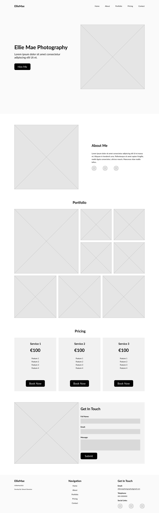

### Prototype

Prototype was created using [Figma](https://www.figma.com/)

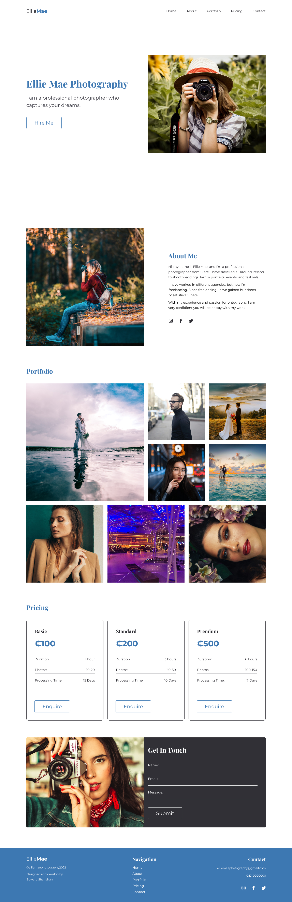

### Typography 
The fonts used are from [Google Fonts](https://fonts.google.com/). The font family for headings is Playfair Display using 700 font-weight. Montserrat is the overall font family, the font-weight is 400 and 700.
### Colour Palette 

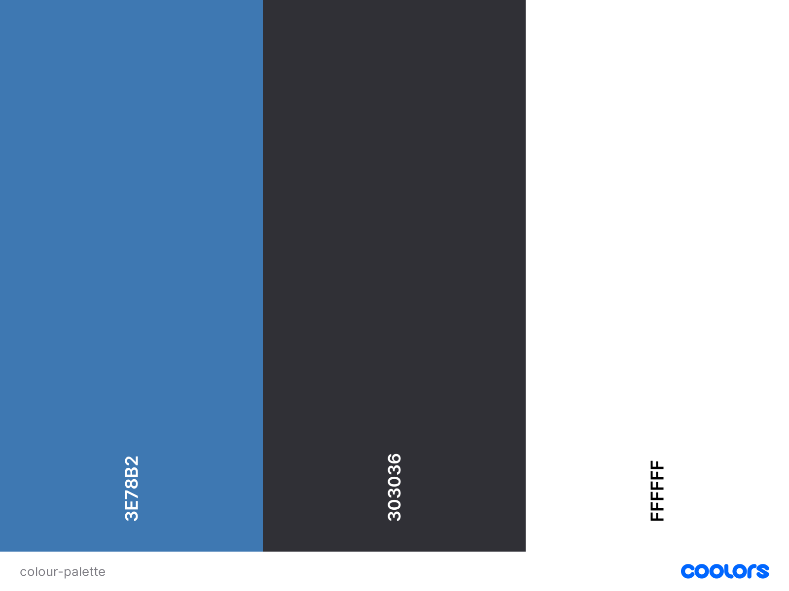

Colour palette was generated using [Coolors](https://coolors.co/).

## Features

### Header

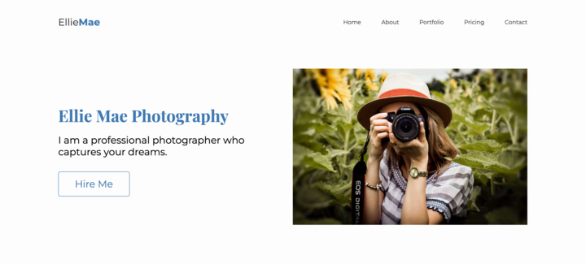

### About Section

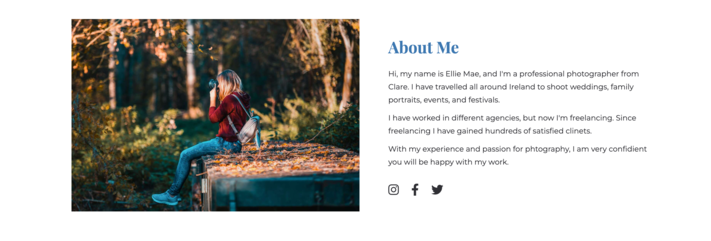

### Portfolio Section

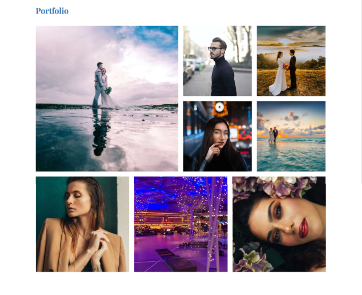

### Pricing Section

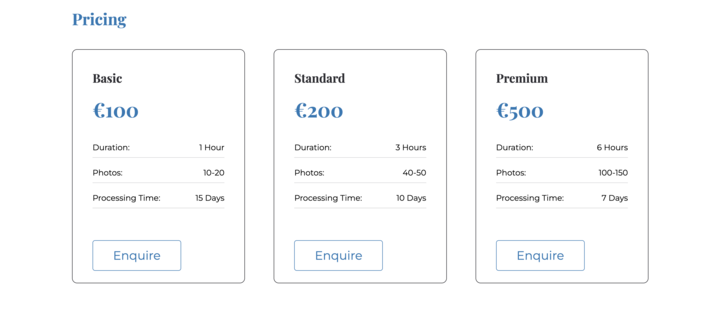

### Contact Section

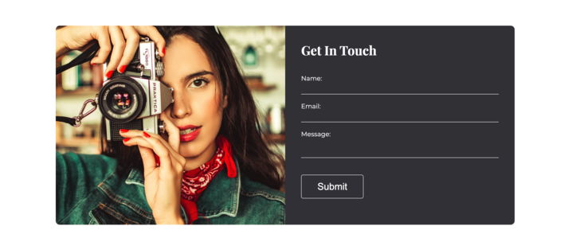

### Footer

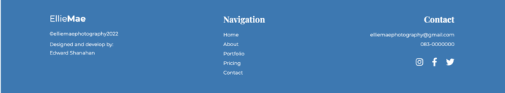

## Testing 

### Browsers
Tested website in three different web browsers and the website works the same in all three.
- Google Chrome 
- Safari 
- Firefox 

### Lighthouse

#### Desktop
Tested website for desktop on Google Devtools Lighthouse and returnd max scores!

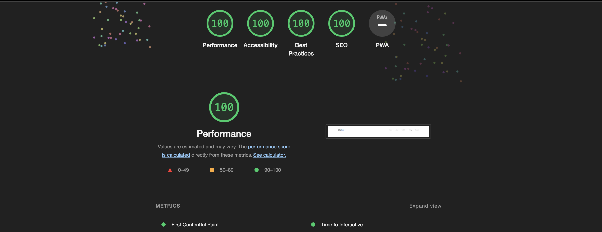

#### Mobile
Tested website for mobile on Google Devtools Lighthouse and returnd hight scores!

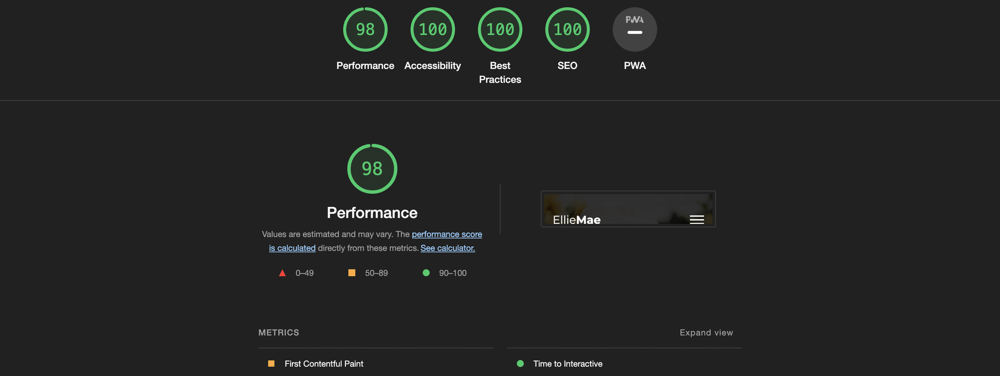

### HTML Validation 
Tested HTML code with [W3C Validator](https://validator.w3.org/) and returned no errors.

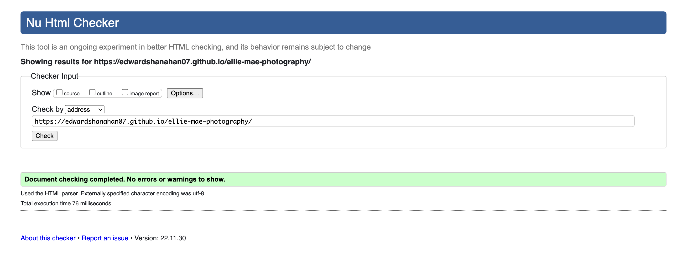

### CSS Validation 
Tested HTML code with [Jigsaw](https://jigsaw.w3.org/css-validator/) and returned no errors.

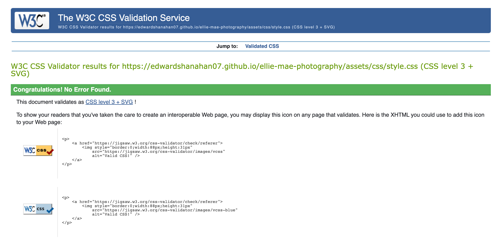

## Credits 

## Deployment 

## Acknowledgment
